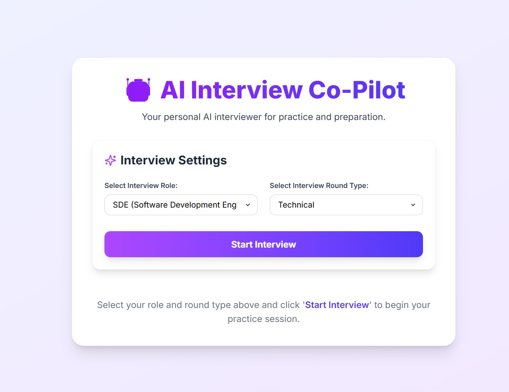

# 🤖 AI Interview Co‑Pilot – Voice-based Interview Practice App
AI Interview Co‑Pilot is an intelligent voice-interactive mock interview tool built with React + Vite and OpenAI’s GPT-4o. It simulates real interviews across multiple roles (SDE, HR, PM, etc.), generating questions, receiving voice or typed answers, and providing real-time spoken feedback.


---

## 🌐 Live Demo

[](https://ai-interviewbot-1.onrender.com/)


---

## ⚙️ Tech Stack

- **Frontend**: React.js (Vite), Tailwind CSS, Lucide Icons
- **AI/LLM**: OpenAI GPT-4o
- ***Voice**: Web Speech API (SpeechRecognition, SpeechSynthesis)
- **Deployment**: Render

---

## 📸 Screenshots

| Home Page | Product Page |
|-----------|--------------|
|  | 


---

## 🔑 Features

- 🎤 Voice Interviewing: Speak your answers using the Web Speech API
- 🤖 AI-Generated Questions: Role-based, round-specific interview questions
- 🧠 Instant Feedback: Spoken + written feedback on your answers
- 🔁 Follow-up Questions: Continuous conversation for immersive prep
- 📱 Responsive UI: Fully responsive, mobile-friendly layout
- 🧪 Role/Round Switching: Choose between SDE, HR, PM, and more

---

## 🚀 Installation

```bash

cd ai-interview-copilot

# Install dependencies
npm install
cd ai-interview-copilot

# Install dependencies
npm install

# Setup environment variable
echo "VITE_GITHUB_PAT=your_github_pat" > .env

# Start development server
npm run dev


📬 Contact
Created by Vinit Tandel
📧 tandelvinit714@gmail.com
